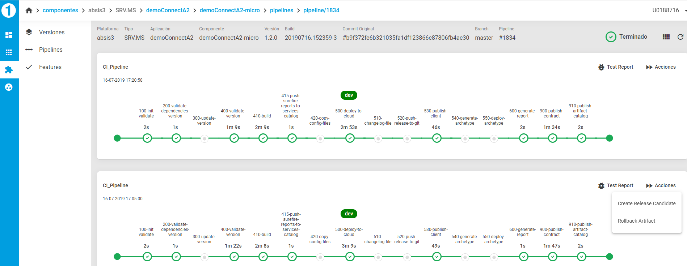
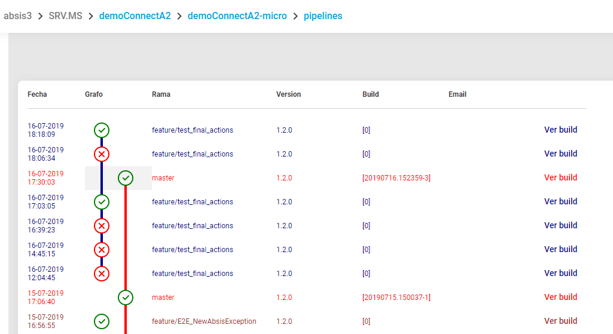

## Disabled policy feature

### Concept

Each application lifecycle step (Build, Create RC, Create Release...) can disable previous actions in the pipeline view. These actions and if the can be disabled are provided once a pipeline finish successfully

Pipelines view:

For example in the below picture has no sense allow showing actions in previous pipelines, only in the last one.

This requirement allows GPL disable actions when they don't have sense due to the current flow or ALM situation:

ALM situation:

With this goal, the ALM defines 4 different specifications for disabling previous actions:

Disabled policy:

* _BY_VERSION_: Disable all the before actions (with disabled capability) for the version component. Example: All the previous actions for the 1.3.0 version
* _BY_BRANCH_: Disable all the before actions (with disabled capability) for the specific branch in a specific version component. 

The following one currently does not have utility:
* _BY_COMMIT_: Disabled all the before actions (with disabled capability) for the specific commit within a branch in a specific version component. 

* _NONE_: Not Disabled the before actions.

### Result and disabled policy

For this in each pipeline result the system has to send to GPL the following information:

- Disabled policy for previous actions
- If its next actions can be disabled by another future pipeline.

#### FeatureResultPipelineData

* **When**: Any branch type of `feature`
* **Origin**: `feature`
* **Disabled policy**: BY_BRANCH
* **Final Actions**:
   1. _Create Merge Request_
      - **Condition**: Finish ok
      - **Can be disabled ?**: YES

Only block actions in the same branch, so only the last pipeline will have the "Create Merge Request" condition and only blocks feature actions

#### MasterResultPipelineData

* **When**: On `master` branch always and when the push origin is a `feature` o `release` branch
* **Origin**: `master`
* **Disabled policy**: BY_BRANCH
* **Final Actions**:
 1. _Create Release Candidate_
  - **Condition**: Always
  - **Can be disabled ?**: YES
 2. _Rollback Artifact_
  - **Condition**: If it is micro app
  - **Can be disabled ?**: YES

In that case has no sense due to master is only one branch, but it is the way to block all posible actions against master. Only the last pipeline in master will have actions and only blocks master actions

#### ReleaseCandidateResultPipelineJobData

* **When**: Action in console: Create Release Candidate 
* **Origin**: `master`
* **Final Actions**: None
* **Disabled policy**: BY_VERSION

Once the release candidate is created a new branch appears, it does not block anything.

#### ReleaseResultPipelineJobData

* **When**: Action in console: Create Release
* **Origin**: `release` 
* **Disabled policy**: BY_BRANCH
* **Final Actions**:
 1. _Deploy PRO_
  - **Condition**: If it is micro app 
  - **Can be disabled ?**: YES 
 2. _Rollback Artifact_
  - **Condition**: If it is micro app 
  - **Can be disabled ?**: YES 

This action will be launch only once, disable all the previous actions for the release branch

#### ReleaseResultPipelineData

* **When**: Push in any `release` branch
* **Origin**: `release`
* **Disabled policy**: BY_BRANCH
* **Final Actions**:
  1. _Create Release _without deploy into TST_
   - **Condition**: Always
   - **Can be disabled ?**: YES
  2. _Create Release deploying to TST__
    - **Condition**: If it is micro app
    - **Can be disabled ?**: YES
  3. _Rollback Artifact__
    - **Condition**: If it is micro app 
    - **Can be disabled ?**: YES

Once the release is created all the rest actions for this version has no sense, for example actions in features for previous branch, first it would be needed update the branch for the new SNAPSHOT version.

#### IopProResultPipelineJobData

* **When**: Action in console: Deploy PRO
* **Origin**: release
* **Disabled policy**: BY_BRANCH
* **Final Actions**:
 1. _Close release_
  - **Condition**: If it is a new version 
  - **Can be disabled ?**: YES
 2. _Canary Deployment_
  - **Condition**: if it is not a new version 
  - **Can be disabled ?**: YES
 3. _Rollback Artifact_
  - **Condition**: Always 
  - **Can be disabled ?**: YES

#### IncCannaryResultPipelineJobData

* **When**: Action in console: Canary Increment
* **Origin**: None
* **Final Actions**:
* **Disabled policy**: BY_BRANCH
 1. _Close release_
  - **Condition**: Always 
  - **Can be disabled ?**: YES
 2. _Rollback Artifact_
  - **Condition**: Always 
  - **Can be disabled ?**: YES
 3. _Canary Deployment_
  - **Condition**: if it is OK Always and canary percentage is lesser than maximum 
  - **Can be disabled ?**: YES

#### CloseResultPipelineJobData

* **When**: Action in console: Close Release
* **Origin**: release
* **Disabled policy**: BY_VERSION
* **Final Actions**: None 

#### RollbackResultPipelineJobData

* **When**:  Action in console: Rollback Artifact 
* **Origin**: ¿?
* **Final Actions**: None

