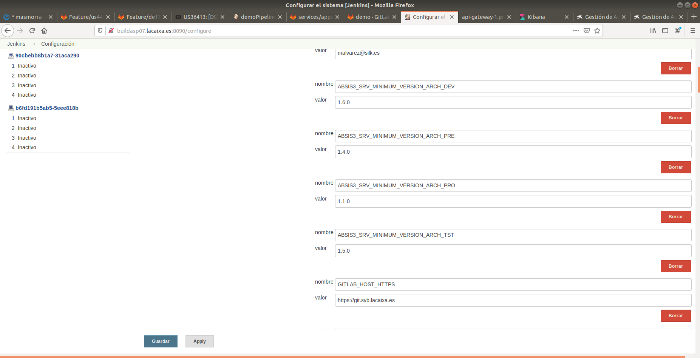

# How To?

This chapter explains how to implement some requirements, a basic how to step by step to implement something.

## Create new ALM pipeline

### Description

The basic requirement is to create a new manual pipeline executed after the CreateReleaseCandidate (for example). This pipeline has to make an echo "Hello World"

#### Step 1. Implement the inherit class of the PipelineStructure

We implement the inherit class of the PipelineStructure defining the stages of the new pipeline type. 

#### Step 2. Implement the inherit class of the ResultPipelineData

The next step is to define the next actions of this job

#### Step 3. Implement the pipeline

Implement the new pipeline, if the pipeline has to report to GSA or GPL, we should init the main classes PipelineData and PomXmlStructure. 

You can add an init method to this job PipelineData and PomXmlStructure... if we don't have a pom we can init the PomXmlStructure like in the RollbackPipeline. 

The PipelineData has an init method specified by every pipeline type.

#### Step 4. Define the jenkins job

You should add the jenkins job in the specific folder...all the manual pipelines are in the alm folder.

#### Step 5. Add this job in the previous pipeline actions

You should add the action LANZAR_JOB in the previous pipeline.

---
			nombre: "Description",
					authorizationService: AuthorizationServiceToInformType.MAXIMO,
					tipoAccion: "LANZAR_JOB",	
					destino: The url to the job,
					parametros:

The job needs authorization, we can add all the parameters needed by the job

#### Step 6. Document the new pipeline

You should document this new pipeline, add the new ascii document to the mainIndex.adoc

## Configure architecture versions

You can configure the minimum version for each environment.

The pipeline validates the artifact architecture version to ensure that is minumum the specified version by the global variables.

The global variables are:

* ABSIS3_SRV_MINIMUM_VERSION_ARCH_DEV
* ABSIS3_SRV_MINIMUM_VERSION_ARCH_TST
* ABSIS3_SRV_MINIMUM_VERSION_ARCH_PRE
* ABSIS3_SRV_MINIMUM_VERSION_ARCH_PRO

## Configure architecture the destination email address

You can configure the email destination in the global variables. The variables is *ABSIS3_SERVICES_EMAIL_DISTRIBUTION_LIST*