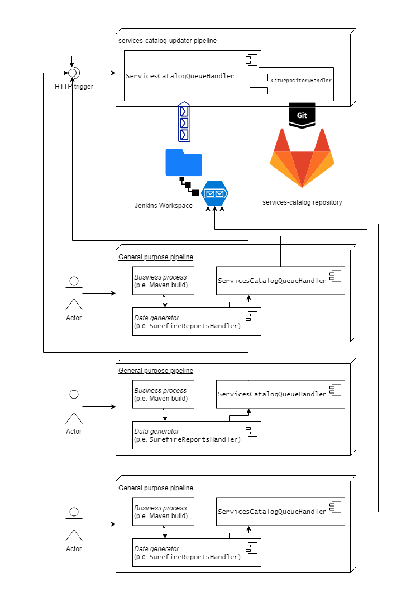

# pipelineServicesCatalogUpdater

## Overview

This document describes the `pipelineServicesCatalogUpdater`, which is a custom pipeline meant to update the `services-catalog` GitLab repository.

The cause of this pipeline to exist is because the need to face a concurrent access scenario towards the aforementioned GitLab repository.
As Git is distributed but does not allow concurrent access, we need a way to allow multiple agents to insert changes in an ordered way which is at the same time transparent for them.

In this case those agents are jenkins pipelines which we are refering as _feeder pipelines_ to.
Those pipelines are likely not purposed to publish items in the repository but doing so as a part of its execution cycle.

### Design considerations

* Access to Git is costly in time. Gets specially slower when the amount of clients consuming the repository is high.
* Git is distributed but does not allow concurrent access, using _pessimistic locking_ instead. This means that parts of the repo being modified by someone are locked meanwhile modifications are taking place.
* Each `commit` & `push` created alters the branch history, forcing the new pusher to `merge`/`rebase` in order to be able to do a new `push`. Implementing all the logic for all the possible cases is undesirable.
* Copying/deleting files using scripting is considerably faster.
* _Feeder pipeline_ behaviour is different depending of the usage we are doing to the data we are publishing:
** Some data does not require real time access (documentation, reporting, etc.).
** Other data is required to be published before the execution of the feeder pipeline can continue (config-server configurations, etc.).

### Proposed approach

In this approach several jenkins pipelines generate data which has to be stored in the `services-catalog` GitLab repository.
They cannot access Git concurrently because each commit modifies the branch history, which forces the new pusher to merge/rebase and push thereafter.
Our tests have shown that a few number agents trying to do publications simultaneously makes the whole process fail, even if `merge` or `rebase` are performed just before the new `push`.

The proposal to solve this issue is making the git access non-concurrent while allowing _feeder pipelines_ to publish data to the repository with apparent concurrency, following an established order according to priority and synchronism needs, as shown in the following graph:

To achieve this goal, several steps are performed:

* The _feeder pipelines_ generate the data of interest.
* The _feeder pipelines have to use an instance of `SurefireReportsHandler` or other implementation of a similar kind to prepare the data to be uploaded to the repository. The purpose of this is leave the data with the same directory structure as it has to be when published into the GitLab repository.
* The _feeder pipelines_ use the helper function `TarballUtils` to prepare a one or more tar files containing the data to be published, following the defined directory structure for the repo.
* The _feeder pipelines_ use the functionality implemented in `ServicesCatalogQueueHandler` to publish the tarballs to the desired queries, according to needs:
** _Sync queue_: for data that has to be published before the execution of the _feeder pipeline_ can continue.
** _Async queue_: for data that does not require the _feeder pipeline_ to stop and wait for its publication.
* The _feeder pipeline_ will now trigger, via `ServicesCatalogQueueHandler` the `pipelineServicesCatalogUpdater` HTTP trigger, according to needs:
** _Async trigger_: The execution of the _feeder pipeline_ will continue until its end.
** _Sync trigger_: The execution of the _feeder pipeline_ will stop, while performing a polling against the sync queue, until the last tarball it requested to publish has been so. Then execution will continue until its end.

Once a HTTP trigger is received, the `pipelineServicesCatalogUpdater` will start execution:

* Depending of established rules, `ServicesCatalogQueueHandler` will publish the content of either one or both queues in a non-concurrent way to the GitLab repository. This is done using the helper class `GitRepositoryHandler`.

|===
**⚠ Note:** Please be advised that the content of the whole queue is currently published, not only the tarballs requested by the _feeder pipeline_ which triggered the operation. However, there is distinction between async and sync queues.
|===

### Requirements for this solution to be implemented

* Shared directory between all jenkins agents involved. This is needed because the queues used on the solution are shared between all of them.
* Priority execution of `pipelineServicesCatalogUpdater` regardless of current agents load. Some plugins have been tried to achieve this goal.
** _Priority Sorter Plugin_: This plugin complies with the purpose with the problem that does not kill non-priority pipelines once the Jenkins slave is saturated.
** _accelerated-build-now-plugin_: This plugin does so, unfortunately it only allows pipelines to be manually fired (by a human).
** A solution that may work is setting affinity of the `pipelineServicesCatalogUpdater` pipeline to the Jenkins master, while not allowing other pipelines to be executed there.
* `pipelineServicesCatalogUpdater` has to be configured not to allow concurrent builds. This is to avoid the pipeline to access concurrently the Git repository.
* For another repository, another implementation of `AbstractQueueHandler` has to be provided.