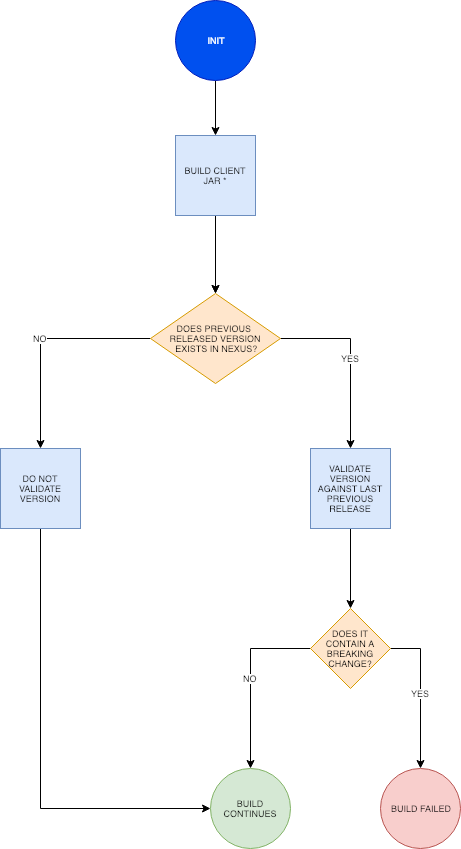

## Stages

[#download-repo]
### download-repo

#### Description

It will download the jenkins pipeline library

#### Conditional execution 

N/A

#### Steps

. It sets the input parameters and modifies the domain value if the type doesn't enable the domain and subdomain
. Downloads the jenkins library repo, it needs locally to invoke the jobDsl

#### Result

Downloads the jenkins library

[#create-default-branch]
### create-default-branch

#### Description

It will create a README file in the master branch

#### Conditional execution 

N/A

#### Steps

. Clones the repo app pipeline repo
. If the README file doesn't exists it will create a sample file

#### Result

The repo will not be an empty repo 

[#create-Job]
### create-Job

#### Description

It will create the jenkinsn job associated with Git repo. For more information, you will see the jobProvisioning

#### Conditional execution 

N/A

#### Steps

. It invokes a DSL job, Provisioning job.

#### Result

The repo will have a jenkins job

[#reconfiguring-git-project]
### reconfiguring-git-project

#### Description

It will invokes the GitLab APi to add some useful information to the gitlab repo

#### Conditional execution 

N/A

#### Steps

. It gets the project id of the gitlab repo.
. It will add some useful flags
. It will get all the project members
. It will add as merge request approvals only the actives members and with the 50 level.

#### Result

The repo will have merge request approvals

[#getBranchesRepo]
### getBranchesRepo

#### Description

#### Conditional execution 

N/A

#### Steps

. Gets the id of the repo
. Gets the repo branches
. Iterates and logs every branch not merged to the master

#### Result

Logs the branches of the git repo.

[#prepare-fix]
### prepare-fix

#### Description

This stage is the main stage of the create hot fix pipeline, it will prepare the new pom and push to the repo of the project, creating the new hotfix branch.

#### Conditional execution

All the request will do this stage.

#### Steps

. Upgrade the version to the new fix (RC0)
. Push to the git repo

#### Result

A branch generated with the new fix version, with the RC0 classifier.

[#reload-micros]
### reload-micros

#### Description

This stage is the main stage of the reload datasource, it has two main phases:

. Get micros installed of this App in a concrete environment. 
. Recreate the datasource config file and upload to the config server repository and refresh the micro.

##### GetMicros installed

It will return all the micros installed on the environment and the infraestucture C1.

It filters all the apps with the name of the app.

##### Recreate and Refresh

It has the next sub-phases

. Clones the TTSS Repo and the config server Repo
. For each micro it will recreate the datasource yaml
. Push all the new datasources config files to the config server repo
. For each app it will refresh everys instance of the micro 

The refresh of the micro is done by the the http request to the actuator endpoint.

. Verifies if the app exists in the infraestucture
. Get the number of instances
. Get the micro center route
. Get the guid
. Makes a loop through the array of instances 
. For each one it makes a request to the actuator refresh endpoint

#### Conditional execution

All the request uses this main step without any condition

#### Steps

. Get all the application micros 
. For every micro the pipeline recreates the datasource yaml and refresh the application

#### Result

. The micro uses the new confiuration of the datasource.

[#refresh-micro]
### refresh-micro

#### Description

This stage refresh the micro configuration.

#### Conditional execution

If the component is a micro and it has an older version.

#### Steps
#### Result

It resets the cannary percentatge of a micro

[#create-MR]
### create-MR

#### Description

This stage opens a Merge Request, to validate the merge of the release branch to the master branch.

#### Conditional execution

Always executes this stage

#### Steps
#### Result

The repo has an opened merge request to validate the integration of the release to the master.

[#get-nexus-artifact]
### get-nexus-artifact

#### Description

This stage dowloads the artifact from nexus (releases), the RELEASE version was generated and deployed to PRE by the PrepareRelease job.

It uses the maven task, dependency:get.

#### Conditional execution

.

#### Steps

. Download the absis3 artifact

#### Result

A workspace with the micro artifact to be deployed on CloudFoundr

[#get-git-code]
### get-git-code

#### Description

This stage runs when git commit is not null. Downloads the code associated with the environment Variable COMMIT_ID

#### Conditional execution

#### Steps
#### Result

[#get-nexus-artifact]
### get-nexus-artifact

#### Description

This stage dowloads the artifact from nexus (releases), the RELEASE version was generated and deployed to PRE by the PrepareRelease job.

It uses the maven task, dependency:get.

#### Conditional execution

.

#### Steps

. Download the absis3 artifact

#### Result

A workspace with the micro artifact to be deployed on CloudFoundry

[#get-git-repo]
### get-git-repo

#### Description

This stage checkouts the code from the git report and init the PomxmlStructureData. 

If the stages is invoked from the CreateReleaseCandidate it generates the new releae branch.

#### Conditional execution

.

#### Steps

. Download the code, from a branch or specific tag
. Generates a new Release branch
. Init the PomXmlStructureData

#### Result

A workspace prepared with the code to build the artifact

[#prepare-RC]
### prepare-RC

#### Description

This stage updates the pom of the artifact to a RC0 or RELEASE version depending the pipeline 

#### Conditional execution

This stage runs on the absisPipelineCreateRelease or absisPipelineCreateRC

#### Steps

Updates the pom.xml  version

#### Result

A new version of the artifact (RC0 or RELEASE)

[#get-git-info]
### get-git-info

#### Description

This stage initialize the pipeline data, the branch structure and sets up the display name for the current build based on the branch name.

#### Conditional execution

This stage runs always.

#### Steps

. inits pipelineData
. send pipeline start to GPL (in case of absisPipelineBuild )
. inits branchStructure
. sets up currentBuild display name

#### Result

If none of the steps fails, the stage will end successfully.

### initAndValidate

#### Description

Retrieves the data from the pom.xml file and validate the branch is valid.

#### Conditional execution

This stage runs always.

#### Steps

. inits pomXml structure
. send pipeline update to GPL (in case of absisPipelineBuild )
. prints debug information
. validates branch

#### Result

If none of the steps fails, the stage will end successfully.

[#update-version]
### update-version

#### Description

Updates the pom version to the next RC.

#### Conditional execution

This stage runs only for Release branches.

#### Steps

. Extracts old version
. Increments version using the maven versions plugin

#### Result

If none of the steps fails, the stage will end successfully.

[#push-release-to-git]
### push-release-to-git

#### Description

Tags the code and send back to git. 

#### Conditional execution

This stage runs only for Release branches.

#### Steps

. Tags the branch with the version tag

#### Result

A tag Release Candidate or Release

[#deploy-nexus]
### deploy-nexus

#### Description

Deploy to nexus the generated artifact when condition. Skipping tests

#### Conditional execution

This stage only run when deployFlag is true and in Master and Releases branches.

#### Steps

In case the artifact needs to be deployed, for master and release branches only and when not working with a Sample App, the artifact will be deployed in Nexus with maven with the goals `clean deploy`. Once is deployed successfully, the Nexus URL and the buildCode are extracted as they will be needed in a future stage to send this information to the catalog.

If the artifact is a Sample App, this will be built with `clean package` goals but it will not be deployed in Nexus.

If the branch is other than release or master, then the artifact is only installed in the local repository with `clean install` goals.

#### Result

Artifact deployed

[#generate-report]
### generate-report

#### Description

Prints info the environment variables and some useful pipeline information

#### Conditional execution

N/A.

#### Steps

. Print environment variables
. Print info Pipeline
, Print info PomXmlStructure

#### Result

Log the info

[#validate-version]
### validate-version

#### Description

Checks the compatibility with previous released versions based on the Swagger contract using https://revapi.org/modules/revapi-maven-plugin/index.html[maven Revapi plugin].

#### Conditional execution
This stage only runs for micro services or data services (`MICRO_APP`).

#### Steps

. *Generate contract pom*
+
The Swagger contract is the single source of truth of a microservice. The compatibility against previous versions needs to be guaranteed before releasing a newer version. In this case, it is only needed to check this compatibility against the classes generated automatically from the Swagger contract, the other classes in the microservice are not considered.
+
For this reason, it is required to generate a separated artifact that only contains these generated classes.
The separated artifact will be used by other services that want to integrate with this service, so from now on it is called the client artifact. The client artifact is generated using a _fake_ pom so the **groupId** can be changed to avoid collisions with the microservice artifact iself.
So the client artifact will have the same groupId as the microservice plus the keyword `.contract`.
+
In this step, the _fake_ pom maven details are fulfilled based on the details of the microservice and both the pom and the Swagger contract are copied into a temporary folder.

. *Install deploy client artifact*
+
In this step, the client artifact is built locally without deploying it to nexus using the maven profile `checkVersion` and the maven goals `clean verify`. This will run the maven Revapi plugin which will search for an artifact with the same groupId and artifactId as the client artifact and the last previously released version to check if there are breaking changes.
+
This is a diagram showing the process:

#### Result

If Revapi does not find any breaking change, the stage will end successfully.
If Revapi does find breaking changes, the build will fail.

[#build]
### build

#### Description

Builds the artifact 

#### Conditional execution

This stage always runs.

#### Steps

the artifact is only installed in the local repository.

#### Result

If the build of the artifact does not fail, the stage will end successfully.

[#sonar-scan]
### sonar-scan

#### Description

send code to Sonar server 

#### Conditional execution

This stage execute sonarScanWorkspace.groovy for a list of artifact types

#### Steps

the artifact code and test coverage by jacoco.exec file are sent to Sonar server using goal sonar:sonar from sonar plugin
after the execution a dashboard url is saved in pipeline.testData variable in order to sent it to GPL

#### Result

If the code is sent, the stage will end successfully.

[#sonar-quality-gate]
### sonar-quality-gate

#### Description

wait until Sonar server finish to analize source code

#### Conditional execution

This stage always runs.

#### Steps

step is waiting until Sonar server finish.

#### Result

If the code quality is OK then the stage will end successfully.
If the code quality has issues then the stage will end with pipeline error.
If the code quality has a timeout (10 minutes) the stage will end with pipeline error

[#undeploy-artifact]
### undeploy-artifact

#### Description

Recover the previous version and delete the new one.

#### Conditional execution

This stage always runs.

#### Steps

. Start the ancient app (only if exists)
. Map the app route to the ancient (only if exists)
. Map the beta route to the ancient (only if exists)
. Unmap the app route to the new one
. Unmap the beta route to the new on
. Delete the new one app
. Rename the ancient app to the new one (only if exists)

### Result

_It depends on the input parameters, if the pipeline has to validate the ancient app it step may throw an execption

[#copy-config-files]
### copy-config-files

#### Description

Copies the config files provided in the `src/main/resource` of the microservice and pushes them to the Config Server Git repository.

#### Conditional execution

This stage runs for microservices that are going to be deployed in Bluemix for the environments of PRE and PRO only.

#### Steps

. Clones Config Server Git repository in `config-repo` temp directory accordingly to the environment where the pipeline is deploying.
. If the artifact is a dataservice, we will do these extra steps:
  . Clones the system repo of the same environment
  . Looks for the systems yaml of the application. The priority is:
    . The same major and app
    . The same app
    . Otherwise it throws an exception, we will do these extra steps.      
  . Generates the app application.yml with the definition of the datasource
. Creates if not exists a directory with the spring application name inside `services/apps`.
  . If the app is a dataservice, we will do these extra steps:
    . Compare the new datasource file against the file generated in the config server, if the file is the same the pipeline will not push the new file.
. Copies all files under `resources` recursively to the directory previously created, maintaining the same folder structure.
. Removes all files not matching `application[^-standalone]*`.
. Commit and push the changes to the Config Server Git repository.
. Delete `config-repo` from local.

### Result

If none of the steps fails, the stage will end successfully.

[#deploy-to-cloud]
### deploy-to-cloud

#### Description

Deploys the artifact to the cloud. The environment is defined by the pipeline.
The process will generate the new manifest will be generated by the process, if the micro is a data-service, the cups of the database credentials will be generated by the pipeline.

If the arch version of the artifact needs a jdk 1.11 the process will use an environment variable for the Open JDK 1.11.

#### Conditional execution

This stage only runs when deployment is required.

#### Steps

.

[#deploy-to-cloud-tst]
### deploy-to-cloud-tst

#### Description

Deploys the artifact to the cloud, but only to the TST environment, the TstBmxStructure is generated.
The process will generate the new manifest will be generated by the process, if the micro is a data-service, the cups of the database credentials will be generated by the pipeline.

#### Conditional execution

This stage only runs when deployment is required, and the update to TST is selected

#### Steps

.

[#publish-client]
### publish-client

#### Description

Publishes the client artifacts for absis3 and absis2 for the microservice.

#### Conditional execution

This stage only runs for micro services or data services (`MICRO_APP`).

#### Steps

. *Cleaning temporary directory*
+
First step is cleaning the source folder in the temporary directory created in the <<validate-version>> stage.

. *Generate contract pom for absis3 client*
+
It fulfills the _fake_ pom with the maven details of the microservice and copies both the pom and the Swagger contract into the temporary folder. See <<validate-version, validate-version, step 1>> for more details.

. *Install deploy client artifact for absis3*
+
Deploys the client artifact for absis3 in nexus using the _fake_ pom recently copied into the temporary directory, using the maven profile `generateAbsisClient` and the goal `deploy`.

. *Generate contract pom for absis2 client*
+
It fulfills the _fake_ pom with the maven details of the microservice and copies both the pom and the Swagger contract to the temporary folder. In this case, not only the groupId changes: the artifactId concats the keyword `Absis2` to the current artifactId. See <<validate-version, validate-version, step 1>> for more details.

. *Install deploy client artifact for absis3*
+
Deploys the client artifact for absis2 in nexus using the _fake_ pom recently copied into the temporary directory, using the maven profile `generateAbsis2Client` and the goal `deploy`.

#### Result

If there are no failures during the deployment process, the stage will end successfully.

[#publish-artifact-catalog]
### publish-artifact-catalog

#### Description

Publishes the artifact details to the Absis catalog.

#### Conditional execution

This stage runs for every branch that is not a feature branch.

#### Steps

. Calculates all the data to send (list of dependencies, urls for further info, etc)
. Builds and sends the request to catalog

#### Result

If there are no failures sending the request, the stage will end successfully.

[#Generate-archetype-from-project]
### Generate archetype from project

#### Description

This stage builds a maven archetype using a model project provided in the repository. The model can be on the root of the
repository or inside a module folder. The `archetypeModel` property has to be used to provide the path relative to the project root.
This will be used on a maven `archetype:generate` goal to generate the archetype.

The archetype version will match the one present on the model project provided.
An automated modification of the `archetype.properties` file will be done to achieve that.

#### Conditional execution

This stage will only run if the following conditions are true:

* `pipelineData.isPushCI()` is false.
* `isArchetype` is true.
* `archetypeModel` contains a non-empty string, which corresponds to the folder where the model project is.

#### Steps

. Call to `generateArchetypeFromProject` helper function. `archetypeModel` has to be provided.

#### Result

An archetype built on `./{archetypeModel}/temp/{archetypeModel}` folder, relative to the project root, inside
the Docker container.

[#Deploy-archetype-into-Nexus]
### Deploy archetype into Nexus

#### Description

This stage deploys an already-built archetype into Nexus. The archetype is assumed to be on
`{archetypeModel}/target/generated-sources/archetype`, relative to the project root.

#### Conditional execution

This stage will only run if the following conditions are true:

* `pipelineData.isPushCI()` is false.
* `isArchetype` is true.
* `archetypeModel` contains a non-empty string, which corresponds to the folder where the model project is.

We are assuming that the previous stage ran and finished successfully.

#### Steps

. Call to `deployArchetypeIntoNexus` helper function. `archetypeModel` has to be provided.

#### Result

A maven archetype artifact, with versioning according to its `pom.xml` file, will be deployed on Nexus.

[#close-release]
### close-release

#### Description

Close a release redirecting all the urls to the new instance and stop ancient instance.

#### Conditional execution

This stage always runs.

#### Steps

. Unmap the app route of the ancient 
. Unmap the beta route of the ancient
. Map the app route to the new one
. Map the beta route to the new one
. Stop the ancient app 

### Result

[#publish-documentation]
### publish-documentation

#### Description

This stage publishes the documentation of each artifact into a GIT repository.

#### Conditional execution

This stage always run.

#### Steps

This stage executes the following steps:

- Check out the repository **services-catalog** where all the documentation is stored.
- Calculates the path to the folder in the repo depending on if it is an application or an architecture artifact. The format of the path is:
   `services/[arch|apps]/<artifactName>/v<majorVersion>/<version>`
+
Where `version` contains `SNAPSHOT` when the CI build runs in the branch _master_. Otherwise is always the version of the pom.xml without the qualifier.
- Based on the pipeline and the type of artifact it is decided which documentation is copied:
   - Pipeline is CI: only contract would be copied in case the application is a Micro App or Micro Arch.
   - Pipeline is createRelease and artifact is Micro App: product documentation, static content and contract.
   - - Pipeline is createRelease and artifact is Micro Arch: product documentation and static content.
   - - Pipeline is createRelease and artifact is other: product documentation.
- Copy the documentation
- If the artifact belongs to architecture, then it generates an `index.md` at the _artifactName_ folder level, with the reference to every version and another one in the version folder to link to each content.
- Commit and push the new files to the `services-catalog` repository.

#### Result

If none of the above mentioned steps fails, the stage will end successfully.

[#validate-dependencies-version]
### validate-dependencies-version

#### Description

Validates the version of the parent pom, dependencies and plugins defined in the pom.xml file based on:

- Artifacts with a RC version cannot have SNAPSHOT dependencies.
- Artifacts with a released or final version cannot have SNAPSHOT or RC dependencies.

#### Conditional execution

This stage always runs.

#### Steps

1. If the pipeline is CI, it only runs when the branch is release. Then, it checks if there is any SNAPSHOT dependency defined in the **pom.xml**. If so, it throws an error and the pipeline fails.
2. If the pipeline is CreateRC, it checks if there is any SNAPSHOT dependency defined in the **pom.xml**. If so, it throws an error and the pipeline fails.
3. If the pipeline is CreateRelease, it checks if there is any SNAPSHOT or RC dependency defined in the `pom.xml`. If so, it throws an error and the pipeline fails.

#### Result

If the dependencies are OK, the stage will end up successfully but if the dependencies are not correct, it will throw an error. The error will print out which are the incorrect versions found in the **pom.xml**.

[#apimanager-technicalservices-registration]
### apimanager-technicalservices-registration

#### Description

Registers the swagger contract (if applies) into API Manager (adpbdd-micro).

#### Conditional execution

This stage runs if ABSIS3_SERVICES_APIMANAGER_TECHNICALSERVICES_REGISTRATION_ENABLED is true and pomXml.artifactName is not in the ABSIS3_SERVICES_APIMANAGER_TECHNICALSERVICES_REGISTRATION_SKIP_LIST.

#### Steps

1. Performs registration
2. If fails, pipeline aborts if ABSIS3_SERVICES_APIMANAGER_TECHNICALSERVICES_REGISTRATION_IF_ERROR_THEN_PIPELINE_FAILS is true

#### Result

Swagger contract is registered into API Manager.
